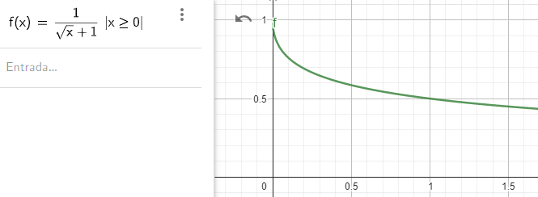

### Sources
---
* Center for information resilience (twitter data on confirmed attacks) - https://github.com/mauforonda/ukraine
* FIRMS archive data - https://firms.modaps.eosdis.nasa.gov/download/
* What is FIRMS - https://www.earthdata.nasa.gov/faq/firms-faq
* How to use FIRMS data - https://www.arcgis.com/home/item.html?id=b8f4033069f141729ffb298b7418b653
* FIRMS manual - https://modis-fire.umd.edu/files/MODIS_C6_Fire_User_Guide_C.pdf
* Ukraine regions - https://geodata.lib.utexas.edu/catalog/stanford-gg870xt4706
* Ukraine cities, Nature reserves, Forests, Rails, Roads - http://download.geofabrik.de/
* Ukraine forest fires https://ceobs.org/countries/ukraine/

### Model
---
FIRMS' detected heat signatures are relatively big events of some tons of materials burning in a period, it is mainly used to track fire paths in wildfires for later be used in prevention and data collection about how our climate is changing through the years. These fires could also be triggered by artillery or sabotage, in other words, intentional fire.

The goal is to differentiate what class the FIRMS detected fire point is, is it a direct attack or a normal accidental fire? If we look just where the fire is happening we can get some clues on what is happening but there is no definitive answer, we have some different classifications that are hard to distinguish like:

|          |Forest                        |Urban                            |
|---       |---                           |---                              |
|Accidental|Wildfire                      |Urban Fire                       |
|Attack    |Attack on Defensible Positions|Attack on Civilian Infrastructure|

With this model, we can mass classification data to track independently and in real-time where the fighting is occurring and the intensity of it.

### Motivation
---
There are several motives to this topic, the biggest one is if this model can detect the intent score of the fire it can help start independent war crimes investigations and help identify climate damage concerning the war.

### Annotation
---
The annotation is done by cross-relating temporal and geographical data from Twitter and NASA's FIRMS, this is done both manually and by bulk relation with data sources like the Center for Information Resilience using PostGIS queries.

Another event to consider is that with war, most services are overloaded or stopped working completely like wildfire fighting in occupied regions, one example is the Biloberezhia Sviatoslava national park which was on fire in the dry months of Russian occupation. We can hand annotate that data as an accidental fire in the period of war but this is when the lines begin to blur, we can argue a causal relation of because the war happened, this fire happened, but this will confuse our model a lot and overfit our data, so for these cases, we annotate as accidental.

|  |
|:--:|
| Twitter report of wildfire |

|  |
|:--:|
| FIRMS detected fires around 2022/05/10 |

### Data
---
Acquired Data:
- `point` or (`lon`, `lat`), coordinate of detection;
- `date`, datetime of detection;
- `brightness`, temperature (in Kelvin) using the MODIS channels 21/22;
- `brightness_t31`, temperature (in Kelvins) of the hotspot/active fire pixel;
- `radiative_power`, pixel-integrated fire radiative power in MW (MegaWatts), related to the rate at which fuel is being consumed;

Synthetic Data
- `dist_road`, distance to the nearest road, None if it's above 2km
- `dist_rail`, distance to the nearest railway, None if it's above 2km
- `pop_density`, averege of nearest population centers weighted by distance using the following equation:

|  |  |
|:--:|:--:|
| Low Density Area, 3.3 avg units | High Density Area, 1524 avg units |
